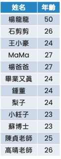
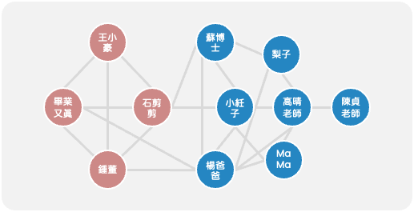

# Day-02

## Why Network Science?
用一個簡單的例子來解釋我為什麼會想要拋棄結構化的資料，投入網路圖的懷抱。

## Example
這個是我們實驗室的年齡分配，單看這些資訊猜猜看哪些同學是同一屆的！！！   

  

假設我們有一個實驗室，其中的成員年齡不盡相同。如果我們只看傳統的資料表格並且使用機器學習去預測哪些同學是同一屆的，這些模型很可能會傾向將年齡相近的人歸為同一屆，這似乎合理，因為歷史數據傾向於顯示，上一屆的學生通常年紀較大。

但是，這樣的方式忽略掉人與人之間的互動。如果我們改用網路圖，以同個實驗室的學生互動作為基礎（這邊的假設是同屆的學生可能會一起修課、寫作業或是一起出去玩）。如下 Fig 1 所示。這樣的關係圖能更好地呈現真實的互動情況，而不僅僅是基於年齡的推斷。

從 Fig 1 也可以看出同個實驗室在互動上分成兩群，像是 Fig 2 這樣，也很合理，畢竟碩一的時候就是修課地獄，一起修課會比較輕鬆，自然比較容易有互動。因此，像是這樣的網路圖更能補足以往結構型資料的缺點。
  
>   
> 
> Fig 1 : 實際互動的網路圖  

> 
>
> Fig 2 : 不同屆用不同顏色表示