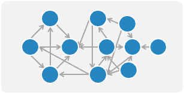
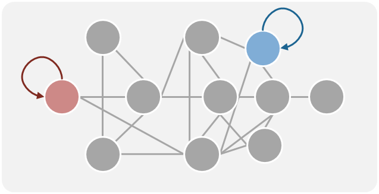

# Day-03

## Network Science 中的常用名詞介紹

在不同領域對於名詞的使用略有差異，不過指的都是同一件事，所以這邊稍微統整一下。

|名詞|數學符號|圖例|
|:---:|:----:|:---:|
|**節點** Node, Vertex|$V$||
|**邊、連結、關係** Edge, Link, Connection, Relation|$E$||
|**圖、網路** Graph, Network|$G(V, E)$||
|**社群** Cluster, Community|$C$||

## Graph 的種類

### 邊的方向性 Direction
在 Network Science 中，有兩種最基本的圖，分別是『無向圖』以及『有向圖』。  

||**無向圖** Undirected Graph|**有向圖** Directed Graph|
|:---:|:---:|:---:|
|定義|連接線無方向性，也可以視為雙向|每條邊有特定方向|
|範例|社交網路中的友誼關係，友誼是雙向的，沒有明確的起點或終點|飛機航線，每條航線有出發地和目的地，具有明確的方向|
|圖例|||

### 邊的權重 Weighted
在進階一點又分為 binary 或是 weighted graphs

||**二元圖** Binary Graph|**加權圖** Weighted Graph|
|:---:|:---:|:---:|
|定義|邊只有兩種狀態，存在（1）或是不存在（0）|每條邊都帶有一個額外的權重，像是這條邊的成本、距離等|
|範例|像是社群網路圖，認識就是（1）；不認識就是（0，通常直接不畫出來） 下面的圖只是一個範例，通常就直接省略不畫出來|假設節點是城市，邊的權重就是城市跟城市之間的實際距離|
|圖例|||

### 節點/邊的屬性 
如果以節點來看，有有分成 homogeneous/heterogeneous graphs
||**同質圖** Homogeneous Graph|**異質圖** Heterogeneous Graph|
|:---:|:---:|:---:|
|定義|所有節點和邊都屬於同一種類型，彼此之間沒有區別|節點/邊擁有多種類型，有些人會稱呼這種圖為『知識圖譜』|
|範例|例如班級內的互動網路圖，只顯示每個人之間的互動關係。節點都是人；邊都是互動|例如下圖中每個節點的屬性就不相同 **名詞**（碩士、論文、貓）、**姓名**（皮皮、小咪、牛奶）、**形容詞**（可愛）、**地點**（台科）等...|
|圖例|||

### 特殊類型的圖
雖然我稱呼它們是特殊類型的圖，但其實下面者幾種圖更符合現實生活中的狀況

|類型|特色|圖例|
|:---:|:---:|:---:|
|Multigraphs|兩個節點之間擁有多條邊，這些邊可能有相同或不同的屬性||
|Self-loop|節點與自己之間存在一條環狀邊||
|Hypergraph|在 Hypergraph（超圖）中，一條邊可以連接多個節點，稱為 Hyperedge（超邊）。  這種圖補足了一般圖中只能顯示節點之間有連接的關係，可以額外顯示出這些節點是『同時』連接在一起的  有些人會用框起來的方式表達這些節點是同時發生；也有人用方形（事件）來把節點連在一起| |
|Dynamic Graph|與一般的靜態圖不同的點在於，它可以隨著時間的推移而變化，意思是指圖中的節點和邊可以隨時間添加、刪除或更改屬性||

## 參考資料
- [Leonid Zhukov, Ilya Makarov : Network Science - Introduction to network science](http://www.leonidzhukov.net/hse/2021/networks/lectures/lecture1.pdf)
- [(一)图和超图-超图学习(Hypergraph Learning)](https://zhuanlan.zhihu.com/p/594699230)
- [Hypergraph Learning: Methods and Practices](https://ieeexplore.ieee.org/abstract/document/9264674)
- [What is a Hypergraph?](https://blog.finxter.com/2-min-computer-science-concepts-what-is-a-hypergraph/)
- [Deep learning on dynamic graphs](https://blog.twitter.com/engineering/en_us/topics/insights/2021/temporal-graph-networks)
- [Social Network Analysis 101: Ultimate Guide](https://visiblenetworklabs.com/guides/social-network-analysis-101/)