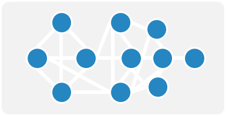

# Day-03

## Network Science 中的常用名詞介紹
|名詞|數學符號|圖示|
|:---:|:----:|:---:|
|**節點** Node, Vertex|$V$||
|**邊、連結、關係** Edge, Link, Connection, Relation|$E$||
|**圖、網路** Graph, Network|$G(V, E)$||
|**社群** Cluster, Community|$C$||

## Graph 的種類

### 邊的方向性 Direction
在 Network Science 中，有兩種最基本的圖，分別是『無向圖』以及『有向圖』。  

||**無向圖** Undirected Graph|**有向圖** Directed Graph|
|:---:|:---:|:---:|
|定義|連接線無方向性，也可以視為雙向|每條邊有特定方向|
|範例|社交網路中的友誼關係，友誼是雙向的，沒有明確的起點或終點|飛機航線，每條航線有出發地和目的地，具有明確的方向|
|圖例|||

### 邊的權重 Weighted
在進階一點又分為 binary 或是 weighted graphs

### 節點/邊的性質 
如果以節點來看，有有分成 homogeneous/heterogeneous graphs

### 特殊類型的圖
|類型|特色|圖例|
|:---:|:---:|:---:|
|Multigraphs||
|Self-loop||
|Hypergraph||
|Dynamic Graph||

## 參考資料
- [Leonid Zhukov, Ilya Makarov : Network Science - Introduction to network science](http://www.leonidzhukov.net/hse/2021/networks/lectures/lecture1.pdf)