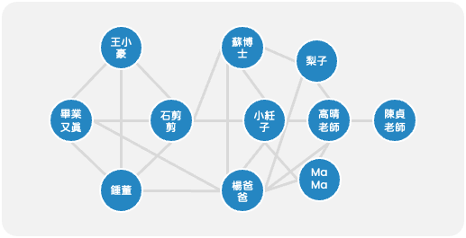

# Day-04-現實生活中有那些可以稱做圖

## 社交網路
- Node : 使用者  
- Edge : 好友、按讚

最簡單好懂的範例就是社交網路，Node 就是使用者；Edge 就是節點之間的關係，可以是好友、按讚等...。舉個例子，假設有一家廠商想要舉辦一場活動，對於廠商來說一定是希望最小化投放廣告的次數跟最大化實際參與的民眾，藉由分析社群網路圖就可以找到某位影響力最大的 KOL，這時候廠商只要對他投放廣告他就會四處揪團邀請其他人一起參加活動。

> 

## 交通網路 - 以台北捷運為例
- Node : 捷運站  
- Edge : 路線  
- Weighted : 站跟站的距離  

> 
## 知識圖譜 - NLP 為例
- Node : 單字
- Edge : 

## 分子結構

- Node : 原子、分子
- Edge : 化學鍵

另外一個很重要的應用就是在化學界，可以用圖的方式去分析分子或是設計藥物。

更多詳細資訊可以參考 [`github/graphein`](https://github.com/a-r-j/graphein) 這份開源專案