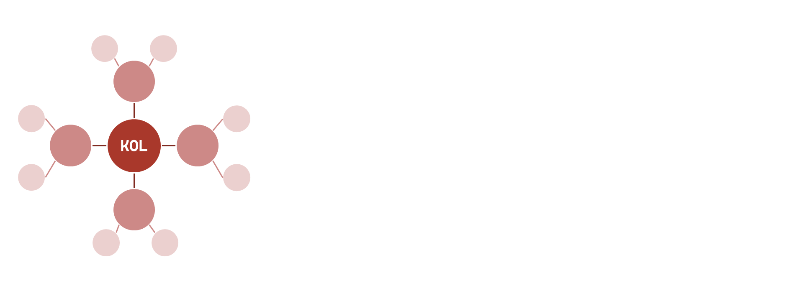
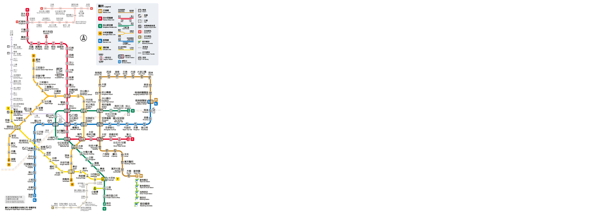

# Day-04-現實生活中有那些可以稱做圖

## 社交網路
>
> Node : 使用者  
> Edge : 好友、按讚

在社交網路中，以圖的架構來解釋，例如將每個使用者視為一個節點（Node），而他們之間的關係，像是好友、按讚則為邊（Edges）。這樣的關係就可以構成一個基本的圖。

像是這樣的圖結構可以幫助公司分析在這個群體內誰是影響力最大的 KOL，有別於以往單看這位 KOL 有多少追蹤，使用圖結構還可以更往更深的部分去探究，像是 KOL 的粉絲會不會進一步把資訊散佈給自己身邊的朋友，獲得更大的影響範圍。

## 相依圖
> Node : 供應商
> Edge : 往來的紀錄

又或者是供應商的  Dependency Graph，可以參考這部[影片 Neo4j - 1 - A Universe of Knowledge Graphs](https://www.youtube.com/watch?v=Ei-pYtYS6UY&t=826s) 中的 `26:00` 左右『Small Dependency, Big Impact』，內容大概是講稍微是一家看似微不足道的供應商倒閉，造成整個產業鏈的影響，如果使用圖的方式，就可以去計算、識別出整個產業鏈中不同供應商的重要程度。

## 交通網路
> 
> Node : 捷運站  
> Edge : 路線  
> Weighted : 站跟站的距離  

另外一個很經典的問題『路線最佳化』，像是柯尼斯堡七橋問題、旅行推銷員問題都是很經典的演算法問題，在現實生活中也有很多類似的應用。像是物流配送商的路線最佳化，可能是尋找兩點之間的最短距離，或者在一次配送中可以配送到多個地點的配送路線都是很重要的。

## 分子結構

> Node : 原子、分子  
> Edge : 化學鍵

分子結構在化學、材料科學以及生物學中是一個重要應用領域。在分子結構的描述上，我們可以用 Node 代表原子或分子，用 Edge 代表它們之間的化學鍵。

舉蛋白質為例，每個胺基酸可以被視為一個 Node，而共價鍵則是 Edge。透過這樣的圖形表示，可以幫助科學家展示、分析和理解蛋白質的結構。像是在製藥產業來說，就可以藉由這樣技術去設計特定結構的藥物，或開發新的藥物。更多詳細資訊可以參考 [`a-r-j/graphein`](https://github.com/a-r-j/graphein) 這份開源專案。

## 圖片來源
- [台北捷運站地圖](https://www.metro.taipei/cp.aspx?n=91974F2B13D997F1)
- [graphein](https://github.com/a-r-j/graphein)