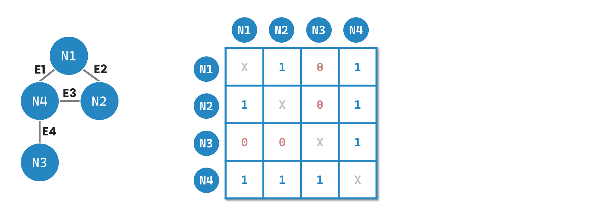

# Day-05-Graph 的資料結構
## Adjacency Matrix

最基本儲存圖的資料結構叫做 Adjacency Matrix 是一個 $|V|\times |V|$ 的二維陣列，假如節點跟節點之間有邊連接就填入 1（或是權重的值）；其餘就填入 0。它的優點在於簡單、好懂、新增或是刪除邊很方便。缺點就是占據非常大的空間 $O(V^{2})$，尤其是整個圖中的邊不多，二維陣列裡面就會有很多 0。計算 Adjacency Matrix 所需的時間為 $O(V)$

> 所需空間：$O(V^{2})$  
> 時間複雜度（確認節點之間有沒有連結）：$O(1)$  
> 適用場景：稠密圖、有向以及無向圖

## Sparse Matrix

有鑑於 Adjacency Matrix 不適合太過稀疏的圖，因此引申出一種新的資料結構稱為 Sparse Matrix，這種資料結構只會保存有邊的資料。

> 所需空間：$O(E)$  
> 時間複雜度（確認節點之間有沒有連結）：$O(\log E)$（可用二分法）  
> 適用場景：稀疏圖、有向以及無向圖

## Adjacency List

Adjacency List 是一種以每個節點作為鍵（key），並與其相連的節點列表作為值（value）的資料結構。每個節點的鍵（key）對應到一個 list，其中包含與該節點相連的其他節點。

> 所需空間：$O(V+E)$  
> 時間複雜度（確認節點之間有沒有連結）：$O(V)$  
> 適用場景： 稀疏圖、有向以及無向圖
## Incidence matrix

$Value = \begin{cases}\phantom{1} -1 & \text{if \textbf{edge} \space leaves vertex,}\\\hphantom{--}1 & \text{if \textbf{edge} \space enters vertex,} \\\hphantom{--}0 & \text{otherwise}\end{cases}$

橫向為節點以及縱向為邊的資料結構。裡面的值為 -1, 0, 1，代表該邊是由該節點往外指向其他節點、沒有邊或是指向該節點。

> 所需空間：$O(V\times E)$  
> 時間複雜度（確認節點之間有沒有連結）：$O(E)$  
> 適用場景： 稀疏圖、有向圖

## 參考資料
- [Graph Data Structure And Algorithms](https://www.geeksforgeeks.org/graph-data-structure-and-algorithms/)
- [Adjacency matrix meaning and definition in DSA](https://www.geeksforgeeks.org/adjacency-matrix-meaning-and-definition-in-dsa/)
- [Graph Representation: Edge list, Adjacency Matrix, and Adjacency lists](https://www.jomaclass.com/blog/graph-representation-edge-list-adjacency-matrix-and-adjacency-lists)
- [Data Structures Tutorials - Sparse Matrix with an example](http://btechsmartclass.com/data_structures/sparse-matrix.html)
- [Comparison between Adjacency List and Adjacency Matrix representation of Graph](https://www.geeksforgeeks.org/comparison-between-adjacency-list-and-adjacency-matrix-representation-of-graph/)
- [What is Incidence Matrix?](https://www.electrical4u.com/what-is-incidence-matrix/)
- [Incidence matrix instead of adjacency matrix](https://stackoverflow.com/questions/3667714/incidence-matrix-instead-of-adjacency-matrix)