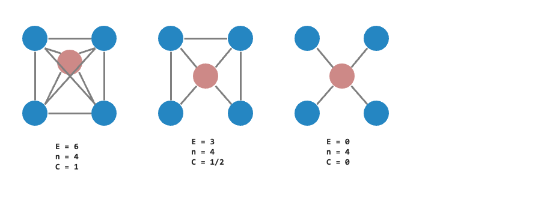
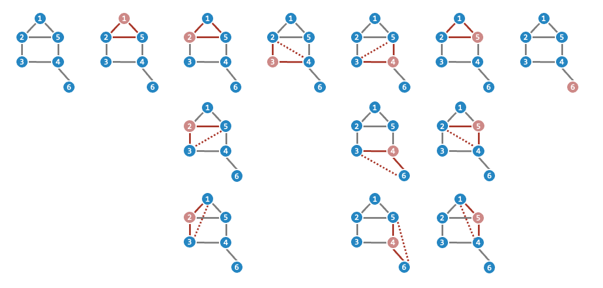

# Day-06-Network Properties

了解到可以使用哪些資料結構儲存圖之後，接下來的第一步就是了解這個圖的性質。也就是資料分析的第一步，了解你的資料集。

下面提供了幾個常見的 network properties，讓各位在拿到資料集之後，可以先用這些 properties 來了解這個圖的基本資訊。

例如，可以計算圖中的節點數量、邊數量、平均度數等。我的邏輯是先從小到大，從 node 開始，再到 edge，最後到整個 graph 的結構。

## Node

|Property|Description|
|:-------|:----------|
|Node In-Degree|指向該節點的連接數量|
|Node Out-Degree|節點指向其他節點的連接數量，較高的 Out-Degree 代表該節點在圖中有較多的影響力|
|Node Degree Distribution|在圖裡面所有節點 Degree 的分佈狀態，顯示出網絡中節點度數的分布模式，例如是否符合 Binomial distribution 等...|
|Average Node Degree|所有節點的平均 Degree，反映出整個圖裡面所有節點的連接程度|
|Maximum Node Degree|所有節點中最大的 Degree|
|Minimum Node Degree|所有節點中最小的 Degree|
## Path Length & Distance
### Diameter（直徑）
Diameter 是指圖中『最長的最短路徑』，也就是圖中兩個節點之間最遠的距離。

### Average Path Length
藉由計算途中所有節點之間的最短路徑，並取平均值，來了解整個圖的平均路徑長度。

## Clustering Coefficient
### Local Clustering Coefficient（單一節點）

主要是計算單一個節點與其鄰居節點之間的連接緊密程度。

- $E_{i}$ : 節點 $i$ 的相鄰節點之間的邊數  
- $n_{i}$ : 節點 $i$ 的相鄰節點數量
- 實際公式 : $C_{i} = \frac {2E_{i}}{n_{i}(n_{i}-1)}$

### Global Clustering Coefficient（網絡中形成三角形的機會）

主要是用來衡量整個網絡中聚集程度的指標。它衡量了網絡中形成三角形的程度，也可以理解成在所有三元組（由三個節點組成，它們之間有兩條連接，triplets）中形成封閉三角形的機會。

- 實際公式 : $C = \frac {3\times \text{number of triangles}}{\text{tnumber of otal triplets}}$
- N1:1, N2:3, N3:1, N4:3, N5:3, N6:0
- $C = \frac{3}{1+3+1+3+3+0} = \frac{3}{11} = 0.27...$
## Structure

### Graph Size
- 節點的總數量
- 邊的總數量

### Connectedness（連通性）

描述網絡中是否存在孤立的部分，簡單來說就是圖中的所有節點是否都可以連通

### Transitivity
描述網絡中形成三角形結構的程度

### Graph Heterogeneity
描述網絡中節點度的異質性，即度分佈的不平均程度

### Motifs
描述網絡中常見的小型拓撲結構或模式，例如三角形、四方形等

## 參考資料
- [Network Science](http://networksciencebook.com/chapter/3#random-network)
- [Global Clustering Coefficient](https://mathworld.wolfram.com/GlobalClusteringCoefficient.html)
- [Clustering Coefficient in Graph Theory](https://www.geeksforgeeks.org/clustering-coefficient-graph-theory/)
- [Social Network Analysis: Lecture 3-Network Characteristics](https://ddu.ext.unb.ca/6634/Lecture_notes/Lec3_network_statistics_handout.pdf)