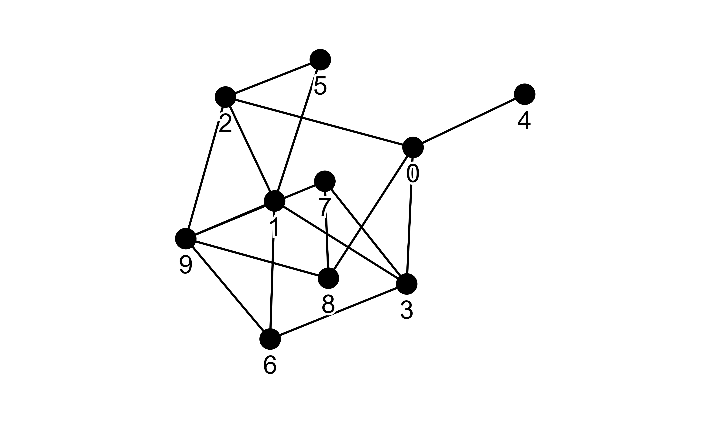

# Day-07-Network Model--Erdős–Rényi model

## 作者介紹
Erdős–Rényi（ER） model 是一種基本的數學模型，並且在 1959 由兩位匈牙利的數學家 Paul Erdős 跟 Alfréd Rényi 發表出來。主要是用來生成 Random Graph，生成圖的原因很簡單，就是用來模擬/研究現實生活中資訊傳播的運作以及影響。其中，ER Model 又是最簡單、易懂的數學模型之一。因為在模型裡只使用到了兩個參數，分別是 `p` 任兩節點之間的連接機率；`n` 為節點的數量，研究人員可以用很簡單方式去產生各式各樣的圖，去模擬資訊傳播的過程。

## 模型定義

- 任選兩節點最多可連接成邊的數量為：$\begin{pmatrix}n \\2\end{pmatrix}$
- 任兩個節點產生邊的機率為：$p$
- 邊的期望值為：$k = p \times \begin{pmatrix}n \\2\end{pmatrix}$

#### Binomial vs. Poisson Degree Distribution

ER Model 的分布為 Binomial Distribution 或是 Poisson Distribution，但是這兩種 Distribution 所使用到的參數不太一樣，Bionominal Distribution 同時使用到 `n` 跟 `k`；Poisson Distribution 只有使用到 `k` 也就是預期產生多少條邊，也因為 Poisson Distribution 計算上比較簡單所以比較受歡迎。

- Binomial Distribution 的公式：$p_{k} = \begin{pmatrix}n-1 \\k\end{pmatrix} \times p^{k} \times (1-p_{k})^{n-1-k}$
- Poisson Distribution：$p_{k} = e^{ - \left\langle k \right\rangle } \frac{{\left\langle k \right\rangle ^k }}{{k!}}$

## 超簡單實作 + 視覺化
直接使用 `networkx` 來生成圖以及使用 `gravis` 來做視覺化。

### 安裝 `networkx` & `gravis`

```python
pip install networkx gravis
```

```python
import networkx as nx
import gravis as gv

G = nx.gnp_random_graph(n=10, p=0.3, seed=42)
gv.d3(G)
```

然後就會產生像是下面的圖。



## 參考資料
- [Network Science](http://networksciencebook.com/chapter/3#random-network)
- [Erdős–Rényi model](https://en.wikipedia.org/wiki/Erdős–Rényi_model)