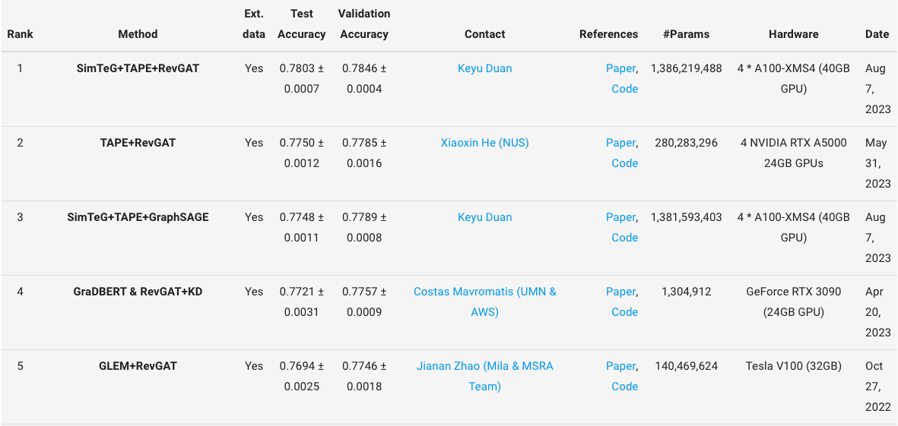

# Day-24-pyG & OGB

## Unpooling Layers
意思跟 pooling 相反，是將 graph 做 upsampling（上取樣）。

## Encodings
雖然還是不確定這個 module 的主要功能，但是我有找到一篇文章跟 paper 感覺跟這個 module 有關，所以先放在這邊。裡面有些數學公式還沒有看懂，之後再來研究。

- [对Transformer中的Positional Encoding一点解释和理解](https://zhuanlan.zhihu.com/p/98641990)
- [GRPE: Relative Positional Encoding for Graph Transformer](https://arxiv.org/pdf/2201.12787.pdf)

## 其他 module
像是 dense convolutional layer、dense pooling layer 等等，都是跟 CNN 相關的概念。

## OGB
OGB 是 Open Graph Benchmark 的縮寫，是一個用來測試 GNN 的 benchmark，裡面有很多不同的 dataset，可以用來測試不同任務下的效能。裡面的任務有 node property prediction、link property prediction、graph property prediction 以及 large-scale challenge 等等。

裡面有一些 submit 的規則，像是要做至少 10 次的 test performance，然後回報 mean 和 std，還有要提供 github repo，如果有 tuned hyperparameters 的話也要提供超參數的範圍還有使用的硬體設施等等。個人認為這個 benchmark 還算蠻完整的，而且使用的 dataset 也都是比較大的（即使上面標註 samll）。

### Leaderboard
我們來看看 arxiv 這個 dataset 好了，它是 node property prediction 的任務，裡面的 node 有大概 17 萬個，edge 有 110 萬條邊（這樣還是 benchmark 中偏小的 dataset...）。

再來看看 leader board 的設備，看起來要做 GNN 的話，對設備的要求還是蠻高的。

這是我用 m2 24 RAM 跑一個 Epoch 的時間，大概 10 分鐘左右。

## Reference
- [Keras中dense层原理及用法解释](https://blog.csdn.net/weixin_44551646/article/details/112911215)

