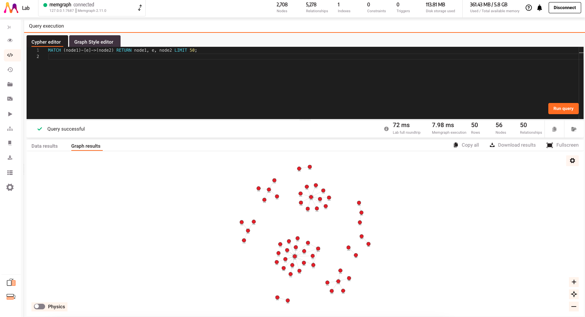

# Day-26 安裝圖資料庫 memgraph & 與 python 連結

## Why memgraph?
目前市面上比較常見的圖形資料庫還是以 neo4j 為主，大部分的書籍也都只有 neo4j，那為什麼我們要用 memgraph 呢？

主要原因是因為 memgraph 比較新，加上執行速度比 neo4j 快（因為底層是用 C++），再加上 memgraph 跟 neo4j 的 query language 都是使用 cypher，所以我覺得不管是學 memgraph 或是 neo4j 在轉換上都不會有太大的問題，那就學新的 ~~~

這篇[文章](https://memgraph.com/blog/neo4j-vs-memgraph)內有比較詳細的解釋 neo4j 跟 memgraph 的差異以及它們適用的場景。

## 安裝 memgraph
現在在 docker 上安裝 memgraph 連指令都不用打了，直接在 extention 上安裝就好了，安裝完後就可以在 localhost:7687 看到 memgraph 的介面了。


## 實際操作


然後點選 `run query sample` 就會看到像是下面的結果。

```sql
MATCH (node1)-[e]->(node2) RETURN node1, e, node2 LIMIT 50;
```

這段 query 的意思是找出符合特定模式的節點和關係。`()` 代表是 node；`[]` 代表是 edge。更多的 query 語法可以參考 [The Complete Cypher Cheat Sheet](https://memgraph.com/blog/cypher-cheat-sheet)




## 使用 python 連接 memgraph

### 安裝 pymgclient
我的電腦是 m2 的 mac 不能直接 pip install，所以我按照[官網](https://memgraph.github.io/pymgclient/introduction.html#build-prerequisites)的教學安裝。

```python
xcode-select --install
brew install python3 openssl@1.1 cmake
pip3 install --user pymgclient --no-binary :all:
```

### 建立連線
```python
import mgclient

conn = mgclient.connect(host='127.0.0.1', port=7687)
cursor = conn.cursor()
cursor.execute("MATCH (n) RETURN n")
row = cursor.fetchone()
```


## Reference
- [How to Use Memgraph With Python and Jupyter Notebooks](https://memgraph.com/blog/memgraph-with-python-and-jupyter-notebooks)
- [Neo4j vs Memgraph - How to Choose a Graph Database?](https://memgraph.com/blog/neo4j-vs-memgraph)