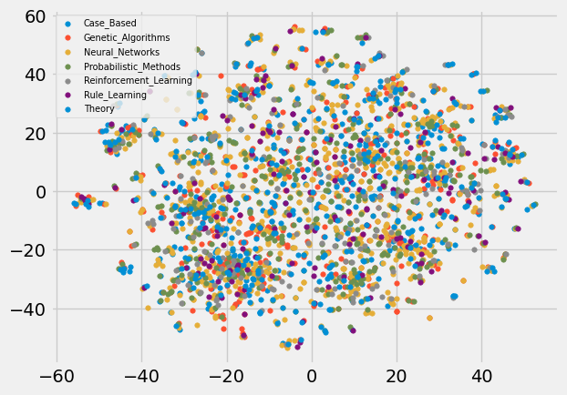

# Day-27 pyG + Node2Vec + Memgraph

## 與 Memgraph 連線

```python
conn = mgclient.connect(host="localhost", port=7687)
cursor = conn.cursor()
```

### 匯出 node 的 properties（x） 跟 label（y） 
```python
# 把中文的 label 轉成數字
subject_map = {
    'Case_Based': 0,
    'Genetic_Algorithms': 1,
    'Neural_Networks': 2,
    'Probabilistic_Methods': 3,
    'Reinforcement_Learning': 4,
    'Rule_Learning': 5,
    'Theory': 6
}

# 讀取 node 的 properties 跟 label
cursor.execute("MATCH (n) RETURN n.features, n.subject")
r_node_properties = cursor.fetchall()

r_node_properties[0]
>>> ([0, 0, 0, ..., 0, 0], 'Neural_Networks')
```

```python
# 轉成 tensor 的格式
x = torch.tensor([x[0] for x in r_node_properties], dtype=torch.float32)
y = torch.tensor([subject_map.get(x[1], 7) for x in r_node_properties])
```

### 匯出 edge（sparse matrix）
```python
cursor.execute("MATCH (n)-[r]->(m) RETURN n.id, type(r), m.id")
r_edge_index = cursor.fetchall()

r_edge_index[0]
>>> (31349, 'CITES', 31336)
```

```python
# 轉成 tensor 的格式
edge_index = torch.tensor([(n1, n2) for (n1, r, n2) in r_edge_index], dtype=torch.long).t().contiguous()
```

```python
# 因為 edge index 裡面的值不是從 0 開始，所以要稍微處理一下
# 改用 indices 來表示
unique_values, indices_edge_index = torch.unique(edge_index, return_inverse=True)

indices_edge_index
>>> tensor([[ 463, 1802, 2390,  ..., 1886,  278, 2094],
        [ 462,  462,  462,  ...,  376,  376,  376]])
```

## 建立 pyG 的 dataset + 切分訓練集與測試集
```python
from torch_geometric.data import Data
from torch_geometric.transforms import RandomNodeSplit

data = Data(x=x, y=y, edge_index=indices_edge_index)
data = RandomNodeSplit('random', num_train_per_class=20)(data)
```

```python
# 訓練集、驗證集、測試集的數量
sum(data.train_mask), sum(data.val_mask), sum(data.test_mask)
```

## 建立 Node2Vec 的模型
```python
from torch_geometric.nn import Node2Vec
from torch.optim import SparseAdam

device = 'cuda' if torch.cuda.is_available() else 'cpu'

model = Node2Vec(
    data.edge_index, 
    embedding_dim=128, 
    walk_length=20,
    context_size=10, 
    walks_per_node=10, 
    num_negative_samples=1,
    sparse=True
    ).to(device)

loader = model.loader(batch_size=128, shuffle=True, num_workers=8)
optimizer = SparseAdam(model.parameters(), lr=0.01)
```

## 開始訓練
```python
for epoch in range(1, 50):
    model.train()

    total_loss = 0
    for pos_rw, neg_rw in loader:
        optimizer.zero_grad()
        loss = model.loss(pos_rw.to(device), neg_rw.to(device))
        loss.backward()
        optimizer.step()
        total_loss += loss.item()

    print('Epoch: {:02d}, Loss: {:.4f}'.format(epoch, total_loss / len(loader)))
```

## 將 embedding 的結果視覺化出來

```python
# 先用 t-SNE 把 embedding 完的結果降維
from sklearn.manifold import TSNE

model.eval()

y = data.y.cpu().numpy()
embedding = model(torch.arange(data.num_nodes, device=device))
embedding_2 = TSNE(n_components=2).fit_transform(embedding.detach().numpy())
```

```python
from matplotlib import pyplot as plt

plt.style.use('fivethirtyeight')

@torch.no_grad()
def output_vis():
    for i in range(7):
        output_dim_1 = embedding_2[y == i, 0]
        output_dim_2 = embedding_2[y == i, 1]
        label = list(subject_map.keys())[i]
        
        plt.scatter(output_dim_1, output_dim_2, label=label, s=15)

    plt.legend(loc=2, prop={'size': 7})
    plt.show()

output_vis()
```
