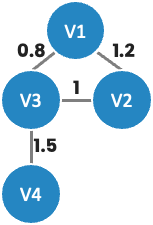

# Paper Reading: A Comprehensive Survey of Graph Embedding

> H. Cai, V. W. Zheng and K. C.-C. Chang, "A Comprehensive Survey of Graph Embedding: Problems, Techniques, and Applications," in IEEE Transactions on Knowledge and Data Engineering, vol. 30, no. 9, pp. 1616-1637, 2018.

## Abstract
1. 定義 graph embedding 與相關概念
1. 指出現有問題與未來研究方向（效能、問題設定、技術、應用場景）

### Graph Embedding 的用處
1. Graph Analytics
1. Dimensionality Reduction
1. Representation Learning

Graph embedding 是目前最有效率解決 graph analytics 問題的方法，因為它將 graph 轉換成低維度向量的同時也保留了結構資訊。

## Introduction
Graph embedding 可以視為圖資料的一種前處理方式，處理後的資料能應用在多種任務，例如 node classification、node clustering、link prediction 等等。

雖然有許多分散式 graph 處理框架，但在效率上仍不如 graph embedding。其涵蓋範圍包括 node、edge、substructure 與 whole-graph 等層面。

一開始 graph embedding 用於降維，2010 年後有人開始將 embedding 結果輸入模型並結合其他資料，為了得到更好的表現，也出現了深度學習相關方法與新的目標函式。

Graph embedding 最困難的部分在於問題設定與技術，如 graph 的輸入類型可以是 homogeneous、heterogeneous 或帶有其他資訊等。

作者將 graph embedding 分為四種類型：node、edge、hybrid 以及 whole-graph，每種類型都有各自衡量優劣的標準。

### Contribution
1. 依問題設定統整挑戰並提出未來研究方向
1. 總結現有方法如何解決特定問題
1. 提供效能、問題設定、技術、應用場景等四個研究方向

### 問題設定與技術總覽
- Graph Embedding Problem Settings
  - Graph Embedding Input
  - Graph Embedding Output
- Graph Embedding Techniques
  - Matrix Factorization
  - Deep Learning
  - Edge Reconstruction
  - Graph Kernel
  - Generative Model

## Problem Formalization
### Notation
- $g = (V, E)$ – graph
- $\hat{g} = (\hat{V}, \hat{E})$ – substructure of $g$
- $v_{i} \in V$ – node
- $e_{i,j} \in E$ – 連接 $v_{i}$ 與 $v_{j}$ 的邊
- $A$ – 關聯矩陣
- $A_{i}$ – 關聯矩陣第 $i$ row
- $A_{i,j}$ – 關聯矩陣第 $i$ row 第 $j$ column
- $f_v(v_i), f_e(e_{ij})$ – node 或 edge 的類別
- $\mathcal{T}^v, \mathcal{T}^e$ – node 或 edge 類別的集合

### First-order proximity $S_{ij}^{(1)} = A_{i,j}$
計算兩節點間邊的權重，也就是 $A_{i,j}$



- 例如上圖中，$v_{1}$ 與 $v_{2}$ 間邊的權重為 1.2，因此 $S_{1,2}^{(1)}=1.2$
- $v_1$ 與其他節點權重表達方式：$S_{1}^{(1)}=[0,1.2,0.8,0]$

### Second-order proximity $S_{i,j}^{(2)}$
計算 $v_{i}$ 與 $v_{j}$ 之鄰居間的相似度

```python
import numpy as np
vec1 = np.array([0, 1.2, 0.8, 0])
vec2 = np.array([1.2, 0, 1, 0])
cos_sim = vec1.dot(vec2) / (np.linalg.norm(vec1) * np.linalg.norm(vec2))
print(cos_sim)
```

### Higher-order proximity
若為更高維度 $k$，則計算 $v_{i}$ 與 $v_{j}$ 在 $(k-1)$ order 的相似度 $\cos(S_{i}^{(k-1)}, S_{j}^{(k-1)})$，可使用 Katz index、rooted PageRank、Adamic–Adar index 等其他量度。

## Graph Embedding Output
embedding output 為 task driven，不同任務適用的方式可能不同。

### Node Embedding
將 node 轉為低維向量，不同方法對「closeness」的定義各異。

### Edge Embedding
與 node embedding 類似，但同時考量 <head, relation, tail> 等資訊，可用於 knowledge graph embedding。

### Hybrid Embedding
同時處理 node、edge 或 community 等多種 components。

### Whole Graph Embedding
將整個 graph 轉為向量，常用於較小的 graph，如 protein 或 molecule。

- hierarchical graph embedding framework 可用來評估 embedding 的品質，例如處理時間與保留資訊量。

## Graph Embedding Techniques
### Matrix Factorization
1. Graph Laplacian Eigenmaps
2. Node Proximity Matrix Factorization

#### Graph Laplacian Eigenmaps
希望保留節點間相似度，若嵌入後距離較遠則給予 penalty。

#### Node Proximity Matrix Factorization
直接分解 proximity matrix，以簡化節點關係的表示。

### Deep Learning
1. Random Walk
2. without Random Walk

#### Random Walk
透過隨機遊走取樣節點，再進行訓練，例如 DeepWalk、node2vec 等方法。

#### without Random Walk
直接使用 autoencoder、DNN 或 CNN 進行學習，如 SDNE、GCN 等。

### Edge Reconstruction Based Optimization
- Maximizing Edge Reconstruction Probability
- Minimizing Distance-Based Loss
- Minimizing Margin-Based Ranking Loss

#### Maximizing Edge Reconstruction Probability
好的 embedding 應能重建原始邊，目標函式需對所有節點加總。

#### Second-order Proximity
在 start node 為 $v_i$ 時，以 $v_j$ 為 end node 的機率來計算。

#### Minimizing Distance-Based Loss
使用 first-order 或 second-order proximity，並以 KL divergence 等距離函數計算差異。

#### Minimizing Margin-Based Ranking Loss
在 knowledge graph embedding 中，藉由最大化關聯節點與非關聯節點間的 margin 來最小化 ranking loss。

### Graph Kernel
將 graph 分解為各種 substructure 的向量，可透過 graphlet、subtree patterns 或 random walk 等方式。

### Generative Model
輸入特定特徵或標籤分佈後生成 graph，例如將 node 映射到 latent semantic space 中。

## Applications
### Node Related Applications
- node classification
- node clustering
- node recommendation/retrieval/ranking

### Edge Related Applications
- link prediction
- triplet classification

### Graph Related Applications
- graph classification
- visualization

### Other Applications
- knowledge graph
- multimedia network
- information propagation
- social network alignment
